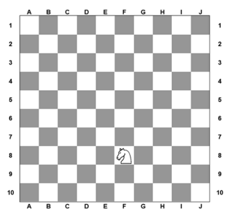
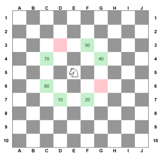

<h1 style="text-align: center;">Projeto Época Normal - Fase 1</h1>

<div style="text-align: center;">


<h2>2023/2024</h2>

<h2>Inteligência Artificial</h2>

<h2>Docente: Joaquim Filipe</h2>


<h2>Realizado por:</h2>
<h3>Francisco Vaz Nº 202100217</h3>
<h3>Jaime Vieira Nº 202100108</h3>
<br>
<br>
<h2>Jogo do Cavalo - Manual Técnico</h2>

<br>
</div>

## Índice


## Jogo do Cavalo: Descrição Geral
O Jogo do Cavalo é uma variante do problema matemático conhecido como o Passeio do Cavalo, cujo objetivo é visitar todas as casas de um tabuleiro similar ao de xadrez. Nesta versão, o tabuleiro terá 10 linhas e 10 colunas (10x10), e cada casa terá uma pontuação. Esta seção fornecerá uma visão geral do jogo, enquanto a próxima seção explicará o projeto de Inteligência Artificial que visa resolver um problema nesse contexto através da busca em Espaço de Estados. 


## Arquitetura do Sistema

O Jogo Do Cavalo foi implementado em linguagem LISP. A estrutura do projeto é composta pelos seguintes ficheiros:

- `projeto.lisp`: Interação com o utilizador, escrita e leitura de ficheiros.
- `puzzle.lisp`: Implementação da resolução do problema incluindo seletores e um operador geral.
- `procura.lisp`: Implementação dos algoritmos de procura BFS, DFS e A* com funções auxiliares e as heurísticas .
- `problemas.dat`: Funções com os problemas de A a F.


## Entidades e sua implementação

### Tabuleiro

O tabuleiro consiste numa apresentação na forma de uma lista de listas em LISP, composta por átomos. Cada átomo representa uma casa com um valor numérico. O tabuleiro é representado por 10 linhas e 10 colunas. Temos, portanto, um total de 6 problemas que são os tabuleiros A a F implementados no arquivo `problemas.dat`.

<div style="text-align: center;">


</div>


## Regras do Jogo
Nesta secção do documento, vamos descrever as funções e regras implementadas no projeto, sabendo que os movimentos apenas podem ser realizados em posições disponíveis do tabuleiro.


### Regra do Cavalo

A regra do cavalo permite colocar o cavalo em Jogo. Normalmente, essa regra é usada no início da procura do tabuleiro em questão. Essa regra pressupõe que o cavalo pode ser colocado numa casa com valor numérico e apenas na primeira linha do tabuleiro. A solução consiste em um conjunto de sucessões de casas disponíveis, levando em consideração uma operação especial do cavalo aplicando as mesmas regras definidas acima (Regra do Duplo e Simétrico).

 ### Regra do Simétrico
A regra do Simétrico coloca o simétrico do valor da casa do movimento como indisponível (NIL).


```Lisp

  ```

### Regra do Duplo

A regra do duplo verifica-se o valor da casa do movimento realizado é um número duplicado. Se o número for duplicado, coloca a casa com o maior número duplicado disponível no tabuleiro como indisponível.

 ```Lisp
  ```

## Funções 

## Representação de Estados
O Jogo do Cavalo permite que o tabuleiro tenha várias possibilidades de jogadas e caminhos até encontrar uma solução. Neste caso, o problema é equacionado em termos de estados, onde são representados os estados através de uma estrutura de dados sequencial. Os operadores permitem a transição dos estados desde o estado inicial até o final, podendo-se utilizar a exploração de árvores para isso. Para representar o estado do problema, utilizamos um tipo abstrato "nó".


### Operadores
Os operadores representam os movimentos possíveis em um determinado estado. Para o Problema do Cavalo, o número máximo de movimentos possíveis é 8, desde que essas casas ainda não tenham sido visitadas ou removidas pela regra dos simétricos ou duplos.

<div style="text-align: center;">


</div>

### Nó
A composição do nó é uma lista composta por:

```Lisp
(defun cria_no (estado &optional (profundidade 0) (pai NIL) (heuristica 0))
  (list estado profundidade pai heuristica)
)
```
# Algoritmos 
## BFS (Breadth First Search)
Este algoritmo consiste na pesquisa por largura dos estados do nó da raiz até ao nó solução (GOAL), explorando os nós vizinhos na profundidade atual do tabuleiro, garantindo que não volte a abrir o nó pai que já foi aberto antes. Os nós explorados são colocados atrás da fila dos nós sucessores.
## DFS (Depth-first search)
O algoritmo DFS permite procurar os nós em profundidade no tabuleiro, ao contrário do BFS que procura na largura. Este explora o nó quando o cavalo se desloca de uma casa para outra ao longo do tabuleiro. Esses nós explorados são os sucessores e colocados à frente da fila dos nós abertos.
## A* (A* Search Algorithm)
O algoritmo A* assim como os anteriores é utilizado para procurar nós em uma árvore, ou seja, os algoritmos BFS e DFS consistem em buscar estados em um espaço de problema menos complexo. Por outro lado, o A* permite a busca de estados em um espaço com problemas mais complexos, gerando uma árvore de sucessores através da função heurística que calcula o custo. Esse custo é então utilizado para ordenar as listas de nós das possíveis jogadas no tabuleiro visando atingir o nó da possível solução.

#### Heuristica Base
Tal como descrito no enunciado, utilizamos uma heurística de base que privilegia visitar as casas com o maior número de pontos para determinar o tabuleiro x. A função heurística h(x) é definida como a razão entre o número de pontos faltantes para atingir o valor objetivo e a média por casa dos pontos que constam no tabuleiro x no momento.

### Heurística


```
```


